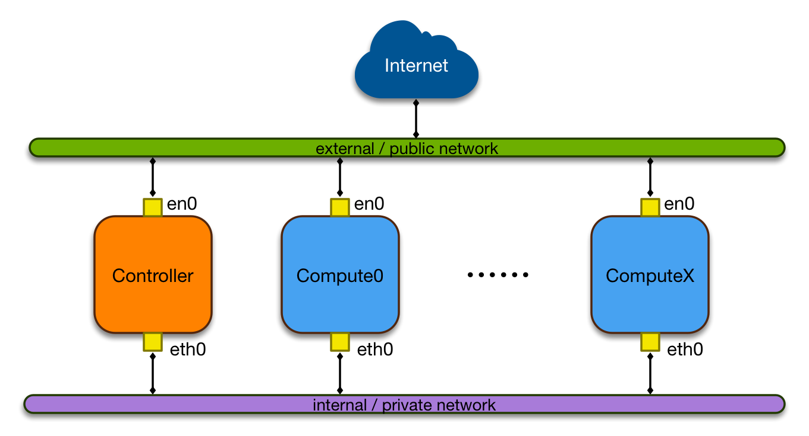

# Cloud Builder for OpenPOWER-Based System

This project is to deploy cloud environment for OpenPOWER-based system with OpenStack and Ceph. It also provides a reference cloud configuration for OpenPOWER.


[TOC]

## System Planning

### Supported OpenPOWER System

Most scripts in repository are written in YAML for ansible. The original intention is for all OpenPOWER systems.

At present, this configuration has been verified on Zoom RedPOWER C210, Tyan Habanero (TN71-BP012), IBM Firestone.

### Operation System

This project is intended to support both Ubuntu and CentOS. At current stage, it only supports Ubuntu as the RDO for RHEL/CentOS is not ready.

For Ubuntu, LTS version is recommeded for its deployment.

Support list for Ubuntu,

- Ubuntu 16.04 LTS


Support list for CentOS,

- TBD


### OpenStack

In this configuration, the core services will be included as follows. The dashboard service, horizon, is in the scope as well.

* Keystone
* Glance
* Nova
* Neutron
* Cinder
* Swift [TBD]

Support list for OpenStack,

- Mitaka

### Networking Infrastructure

The networking in this deployment is based on LinuxBridge but OVS is also supported. For the tenant isolation, Vxlan is used by default. All parameters can be modified in neutron and nova configurations.

In this reference configuration, each node has to be configurated with 2 network interfaces. One is for public network; anther is for private network.




## Installation Guide

In this guide, the external/public network is 192.168.0.0/24. The internal/private network is 172.0.0.0/24.

### Controller/Compute Node

1. Install OS (Ubuntu Server LTS).

2. Update system.

   ```shell
   sudo apt update
   sudo apt upgrade -y
   ```

3. Reboot system.

4. Set password for root to enable root account.

   ```shell
   sudo passwd root
   ```

   sudo passwd root

5. Install openssh-server.

   ```shell
   sudo apt install openssh-server -y
   ```

6. Enable ssh login for root by edit /etc/ssh/sshd_config. Change PermitRootLogin to Yes.

   ```shell
   PermitRootLogin yes
   ```

7. Restart ssh service

   ```shell
   sudo service ssh restart
   ```

8. Install python 2.7.

   ```shell
   sudo apt install python -y
   ```

9. Set network interface name manually.

   External/public network interface: en0

   Internal/private network interface: eth0

   Map network interface with defined name by edit /etc/udev/rules.d/70-network.rules.

   ```shell
   # external/public network interface
   SUBSYSTEM=="net", ACTION=="add", ATTR{address}=="MAC ADDRESS", NAME="en0"
   # internal/private network interface
   SUBSYSTEM=="net", ACTION=="add", ATTR{address}=="MAC ADDRESS", NAME="eth0"
   ```

   Replace **MAC ADDRESS** with network interface MAC address.

10. Set IP address for en0 and eth0 by editing /etc/network/interfaces.

    > auto en0
    > iface en0 inet static
    > address 192.168.1.101
    > netmask 255.255.255.0
    > gateway 192.168.1.1
    > dns-nameserver 9.0.148.50
    >
    > auto eth0
    > iface eth0 inet static
    > address 172.0.0.11
    > netmask 255.255.255.0

11. Set host name in /etc/hostname and write all node entities in /etc/hosts.

    After set host name in /etc/hostname, run

    ```shell
    sudo hostname -F /etc/hostname
    ```

    Set node entities in /etc/hosts with IP addresses for internal/private network, for example

    > \# OpenPOWER OpenStack cluster
    > 172.0.0.11      op-controller	**controller**
    > 172.0.0.21      op-compute-01
    > 172.0.0.22      op-compute-02

    Notice that leave the **controller** at the end of the controller line.

12. Reboot system.


### Deployment System

1. Install ansible.

   ```shell
   sudo apt install ansible -y
   ```

2. Clone the repository.

   ```shell
   git clone https://github.com/CBO
   ```

3. Modify CBO/ansible/ansible_hosts and set root password.

   In ansible_hosts, use the IP addresses of external/public network.

   For example,

   ```yaml
   [all:vars]
   ansible_ssh_user=root
   ansible_ssh_pass=PASSWORD

   [cbop:children]
   cbop-repo
   cbop-controller
   cbop-compute

   [cbop-repo]
   redpower-sh-01 ansible_ssh_host=192.168.1.101

   [cbop-controller]
   op-controller ansible_ssh_host=192.168.1.101 ENABLE_REPO=False

   [cbop-compute]
   op-compute-01 ansible_ssh_host=192.168.1.102 ENABLE_REPO=False
   op-compute-02 ansible_ssh_host=192.168.1.102 ENABLE_REPO=False
   ```

4. ​

5. Deploy controller node.

   ```shell
   cd CBO/ansible
   ansible-playbook -i ansible_hosts cbop-compute.yml
   ```

6. Deploy compute node.

   ```shell
   ansible-playbook -i ansible_hosts cbop-compute.yml
   ```

   Controller node and compute node can be deployed parallelly.

7. Wait untill deployment finishes. The dashboard is on the controller node. It can be access via browse.


   > http://***CONTROLLER***/horizon


   Replace CONTROLLER with your controller external IP.


## Q&A

1. Can these scripts be run on x86 system?

   By default, all scripts are designed for OpenPOWER-based systems. You need to modify some parts of the scripts if you want to run it on x86 system. It is not in maintenance scope.

2. Can it be deployed in nested KVM on OpenPOWER system?

   Yes. The scripts are able to deploy on virtual machine. In compute node, kvm_pr will be loaded. The performance is not as good as kvm_hv.

3. How to create public and private after provisioning?

   ```shell
   # Create public network
   neutron net-create public --router:external True --provider:physical_network public --provider:network_type flat

   # Create private network
   neutron net-create private --router:external False --provider:network_type vxlan
   ```
   ​


IBM @ GitHub - http://ibm.github.io/
